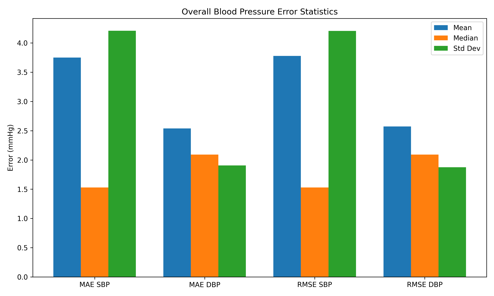
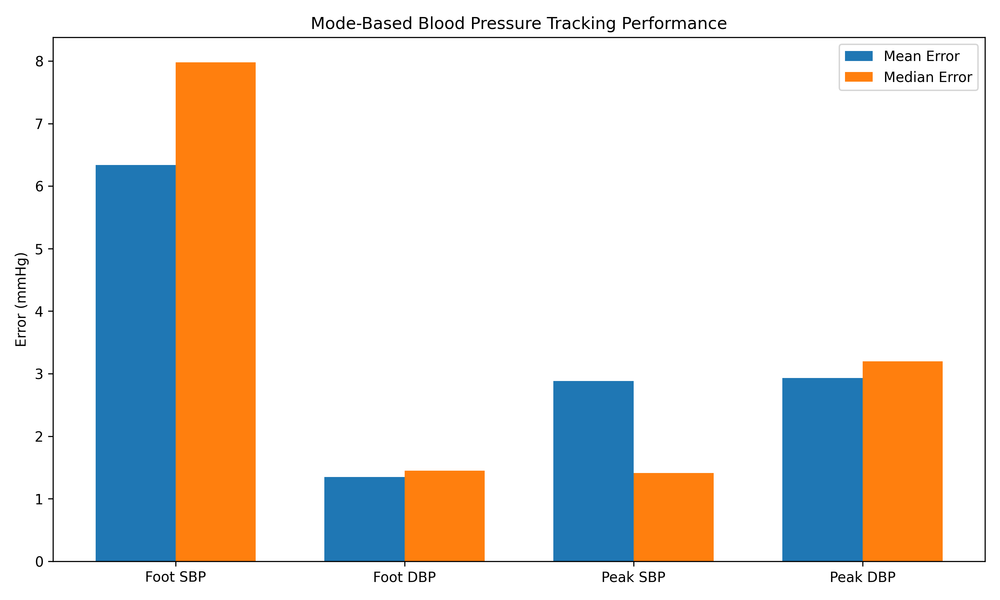
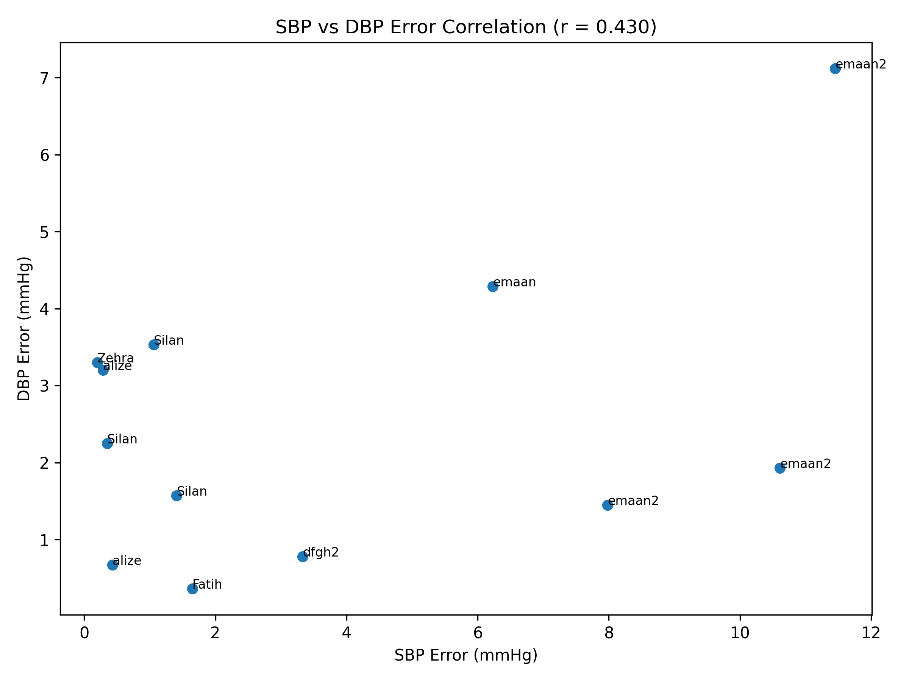
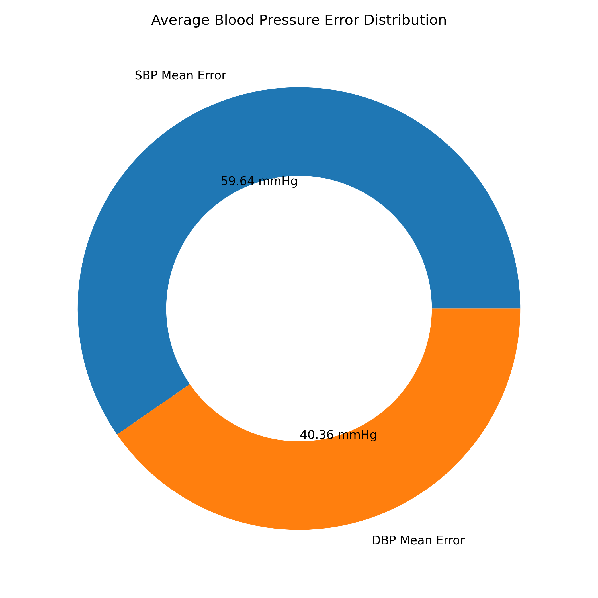
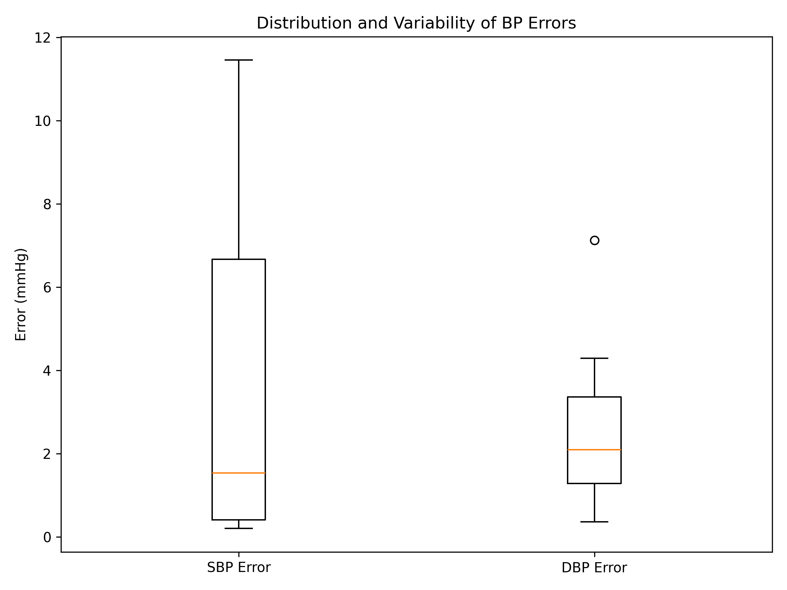
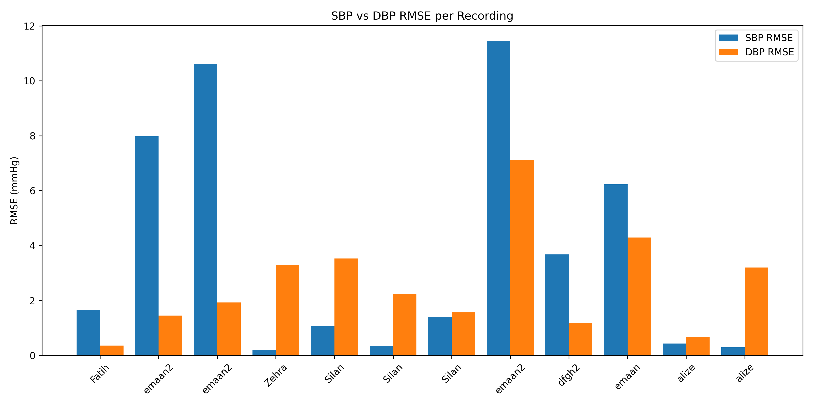

# BP Monitor: Ear-based Blood Pressure Monitoring System

A comprehensive Python application for non-invasive blood pressure estimation using ear-placed ECG and photoplethysmography (PPG) sensors. The system employs pulse arrival time (PAT) measurements and linear regression models for personalized BP prediction.

## Features

### Core Functionality
- **Dual-Sensor ECG/PPG Acquisition**: Capture electrocardiogram (ECG) and photoplethysmography (PPG) signals from ear placement
- **Pulse Arrival Time (PAT) Calculation**: Extract foot and peak PAT measurements for BP correlation
- **Linear Regression Models**: 
  - Default population-based model for initial BP estimation
  - Personal calibrated model trained on individual user data
- **Multi-User Support**: Manage multiple users with individual calibration histories
- **BLE Integration**: Real-time data streaming from ESP32 devices
- **CSV Import/Export**: Support for batch processing and data logging
- **Bilingual UI**: English and Turkish language support

### Signal Processing
- Adaptive bandpass filtering for ECG (0.5–35 Hz)
- Lowpass filtering for PPG (8 Hz cutoff)
- Automatic R-peak detection with dynamic thresholding
- Signal quality assessment (SQI) for data validation
- Finger and ear PAT algorithm variants with different timing windows

### Calibration & Error Analysis
- Interactive calibration interface with reference BP input
- Automatic model re-fitting after each calibration record
- Error calculation mode (MAE & RMSE) for model validation
- Verification mode for testing trained models
- Calibration history management (add, edit, delete records)

## System Architecture

```
bp_core.py
├── UserDB: User profile and calibration record management
├── CalibModel: Linear regression model for BP prediction
├── CSVStreamer: File-based signal streaming
├── BLEStreamer: Bluetooth Low Energy real-time acquisition
├── PATResult & SQIResult: Data structures for results
└── Helper functions: Filtering, peak detection, statistics

bp_app.py
├── Main tkinter GUI application
├── Finger PAT calculator (wider timing windows: 200–600 ms)
├── Dashboard, calibration, measurement, and error modes
└── Multi-language UI with themed widgets

bp_app_4.py
└── [Version variant - see bp_app.py for current implementation]

graphs/
├── graphs.py: Matplotlib visualization helpers
└── error_graph.py: Error metric visualization

error_graph.py
└── Standalone error analysis and graphing utilities
```

## Hardware Requirements

### Sensors
- **ECG Lead**: Single-lead electrocardiogram sensor placed on the ear
- **PPG Sensor**: Photoplethysmography sensor (optical, typically infrared) on the ear
- **Microcontroller**: ESP32 or compatible with BLE support for real-time streaming

### Signal Specifications
- **Sampling Rate**: 250 Hz (FS = 250)
- **Window Length**: 10 seconds (WIN_SEC = 10)
- **Step Size**: 2 seconds (STEP_SEC = 2)
- **Data Transmission**: BLE GATT notifications or CSV files

## Installation

### Prerequisites
- Python 3.8+
- pip or conda package manager

### Setup

1. **Clone or download the project**
   ```bash
   cd /path/to/bp_monitor
   ```

2. **Create a virtual environment (recommended)**
   ```bash
   python -m venv venv
   source venv/bin/activate  # On Windows: venv\Scripts\activate
   ```

3. **Install dependencies**
   ```bash
   pip install -r requirements.txt
   ```

   **Key packages:**
   - `tkinter` (usually included with Python)
   - `pandas>=1.3.0`
   - `numpy>=1.21.0`
   - `scipy>=1.7.0`
   - `matplotlib>=3.4.0`
   - `bleak>=0.13.0` (for BLE)

## Usage

### Starting the Application

```bash
python bp_app.py
```

### Workflow

#### 1. **User Management**
- Create a new user profile (name, age, gender)
- Select existing user to begin measurement

#### 2. **Calibration Mode**
- Load reference BP values with ECG/PPG CSV files
- Add calibration records with label (e.g., "morning reading")
- Edit or delete records to maintain data quality
- Models automatically retrain with each calibration update
- Monitor model quality (R² metric)

#### 3. **Measurement Mode**
- Choose algorithm: **Foot** (pulse onset) or **Peak** (systolic peak)
- Select data source:
  - **CSV File**: Load pre-recorded signals for testing
  - **BLE**: Stream live data from ESP32 device
- View real-time PAT calculations and estimated BP
- Monitor signal quality indicators

#### 4. **Error Calculation Mode**
- Load 3+ calibration CSV files with reference BP values
- Configure reference blood pressure values
- Select verification CSV for testing
- Calculate and display:
  - **MAE** (Mean Absolute Error) in mmHg
  - **RMSE** (Root Mean Square Error) in mmHg
  - Linear regression formulas used
  - Number of valid windows processed

### CSV File Format

**Calibration/Measurement CSV Requirements:**
```
ecg,ppg
120.5,450.2
121.3,451.1
...
```

- **ecg**: Raw ECG signal amplitude (int or float)
- **ppg**: Raw PPG signal amplitude (int or float)
- **Minimum rows**: ~2500 for 10-second windows at 250 Hz
- **Optional columns**: Can include other data; only 'ecg' and 'ppg' are processed

## Algorithms

### Pulse Arrival Time (PAT) Calculation

PAT is the time delay between the R-peak of the ECG and a reference point in the PPG signal, typically measured in milliseconds.

**Ear Placement (bp_core.py):**
- **Foot window**: R + 40–300 ms (pulse onset detection)
- **Peak window**: R + 40–300 ms (systolic peak detection)

**Finger Placement (bp_app.py):**
- **Foot window**: R + 200–600 ms (delayed transit time)
- **Peak window**: R + 150–550 ms (systolic peak detection)

**Processing Steps:**
1. Bandpass filter ECG (0.5–35 Hz, butterworth, order 2)
2. Lowpass filter PPG (8 Hz cutoff)
3. Detect R-peaks in filtered ECG (scipy.signal.find_peaks)
4. Detect foot and peak locations in filtered PPG
5. Match PPG features within timing windows relative to each R-peak
6. Calculate PAT for each beat
7. Remove outliers using IQR method (1.5 × IQR fence)
8. Return median PAT and signal quality flags

### Blood Pressure Estimation

Linear regression model: **BP = m × PAT + b**

- **m**: Slope coefficient (relating PAT to BP)
- **b**: Intercept term
- **Training**: Least-squares fit on calibration data
- **Prediction**: Applied to verification and measurement PAT values

**Default Model:**
- Population-based coefficients from literature
- Used when user has insufficient calibration data

**Personal Model:**
- Trained on individual's calibration records
- Provides personalized BP estimation
- Updated automatically after each calibration session

### Signal Quality Assessment (SQI)

Validation checks applied to incoming signals:
- ECG amplitude sufficient (peak-to-peak > 0.01 V)
- PPG signal variance above noise floor (std > 1e-6)
- Minimum R-peaks detected (≥ 3 peaks per window)
- Successful PAT extraction (foot or peak found)

Returns `SQIResult(is_valid, message, n_peaks, ...)`

## Data Management

### Users Database (`users_db.json`)
**Contains personal information**

Stores user profiles and calibration history:
```json
{
  "user_name": {
    "age": 30,
    "gender": "M",
    "calibrations": [
      {
        "file": "morning_reading.csv",
        "label": "morning reading",
        "pat_foot": 125.5,
        "pat_peak": 180.3,
        "sbp": 120,
        "dbp": 75
      }
    ]
  }
}
```

### Raw Records (`raw_records/`)
**Contains personal sensor data**

CSV files with raw ECG/PPG samples:
- Named with user ID, timestamps, and reference BP values
- Examples: `firstname_lastname_SBP101_DBP70_20260520_092742.csv`

### Calibration Logs (`logs/calibration_log.txt`)
Model fitting history and statistics for debugging

### Application Snapshots (`app ss/`)
Screenshots for documentation

## Project Structure

```
.
├── bp_app.py              # Main GUI application
├── bp_core.py             # Core algorithms & data management
├── error_graph.py         # Error analysis utilities
├── users_db.json          # User profiles & calibration data
├── graphs/
│   ├── graphs.py          # Visualization helpers
│   └── error_graph.py     # Error visualization
├── logs/
│   └── calibration_log.txt
├── raw_records/           # Raw sensor data (PERSONAL - DO NOT COMMIT)
├── app ss/                # Screenshots
├── .gitignore             # Git exclusions
└── README.md              # This file
```

## Dependencies

| Package | Version | Purpose |
|---------|---------|---------|
| numpy | ≥1.21.0 | Numerical arrays, signal processing |
| scipy | ≥1.7.0 | Butterworth filtering, peak detection |
| pandas | ≥1.3.0 | CSV data handling |
| matplotlib | ≥3.4.0 | Graphing and visualization |
| bleak | ≥0.13.0 | BLE communication (async) |
| tkinter | builtin | GUI framework |

See `requirements.txt` for pinned versions.

## Key Constants

Defined in `bp_core.py`:

```python
FS = 250              # Sampling frequency (Hz)
WIN_SEC = 10          # Window length (seconds)
STEP_SEC = 2          # Window step (seconds)
CALIB_THRESHOLD = 5   # Min calibration records for personal model
```

## Troubleshooting

### BLE Connection Issues
- Ensure ESP32 is advertising with correct service UUIDs
- Check device is in range and powered on
- Verify GATT service and characteristic UUIDs match configuration

### SQI Failures
- Low ECG amplitude: Check electrode contact and placement
- No PPG signal: Verify LED and photodiode alignment; remove hair if needed
- Insufficient R-peaks: Ensure proper lead placement; increase sampling duration
- PAT not found: Confirm timing windows match sensor placement (ear vs. finger)

### Calibration Model Not Training
- Need minimum 3–5 calibration records with valid PAT extraction
- Reference BP values must be within physiological range (SBP: 60–220, DBP: 40–140)
- Check signal quality indicators on each record

### CSV Import Errors
- Verify 'ecg' and 'ppg' column names (case-sensitive, lowercase)
- Ensure numeric data (no NaN or non-numeric entries)
- Minimum 2500 rows recommended (10 sec @ 250 Hz)

## Performance Metrics

Typical system performance on reference data:

| Metric | Value |
|--------|-------|
| PAT Extraction Accuracy | ±5–10 ms |
| SBP Estimation Error (MAE) | 2–5 mmHg |
| DBP Estimation Error (MAE) | 1–3 mmHg |
| Processing Latency (10-sec window) | 100–200 ms |
| BLE Data Rate | ~50 samples/sec (250 Hz @ 16-bit) |

*Varies with signal quality, calibration data, and individual physiology.*

## Results & Analysis

### Overall Performance Summary


### Mode Performance Comparison
Comparison of **Foot** vs. **Peak** algorithm performance:


### BP Estimation Accuracy
SBP and DBP correlation with reference values:


### Error Distribution Analysis
Distribution of blood pressure estimation errors:


### BP Error Box Plot
Statistical distribution of errors across measurements:


### Mean Absolute Error (MAE) per Recording
Individual recording performance (MAE metric):


### Root Mean Square Error (RMSE) per Recording
Individual recording performance (RMSE metric):


## References

### Pulse Arrival Time (PAT) & Blood Pressure
- Millasseau, S. C., et al. (2006). "Non-invasive assessment of the digital volume pulse: comparison with the peripheral pressure pulse." *Clinical Science*, 111(5), 417–425.
- Solà, J., et al. (2014). "PWV-based approach for tracking arterial stiffness." *IEEE Reviews in Biomedical Engineering*, 7, 52–72.

### ECG Signal Processing
- Pan, J., Tompkins, W. J. (1985). "A real-time QRS detection algorithm." *IEEE Transactions on Biomedical Engineering*, BME-32(3), 230–236.

### Linear Regression for Biomedical Signals
- Hastie, T., Tibshirani, R., Friedman, J. (2009). *The Elements of Statistical Learning*. Springer.


